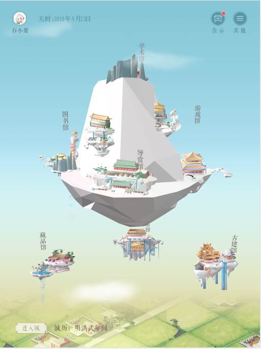
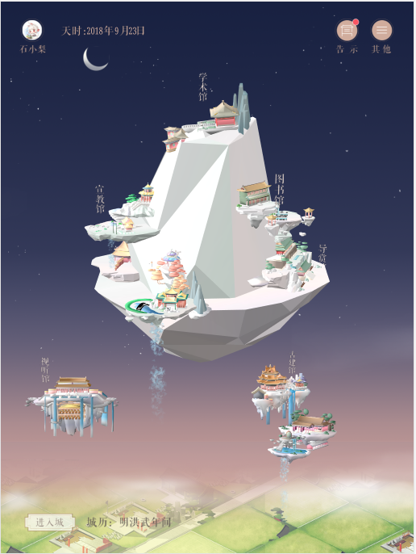
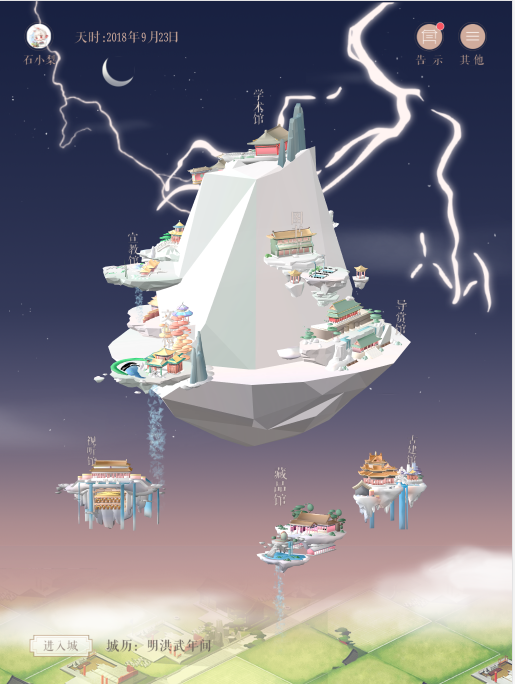

Palace
========
Palace is a web demo of the Forbidden City online community using WebGL.

It's designed for Safari of iPad Pro. 

You can visit the page from [here](https://zooew.github.io/palace/).

Use the [Developer Mode]((https://developers.google.com/web/tools/chrome-devtools)) when visit by PC web explorers.

Details
----------
Below are details of the project.
### Events
Events will happen when click things on the page.
### Day & Night
Day & Night changes every 10s.
#### Day

#### Night

### Thunder
It thunders when the battery status of the device changes.
